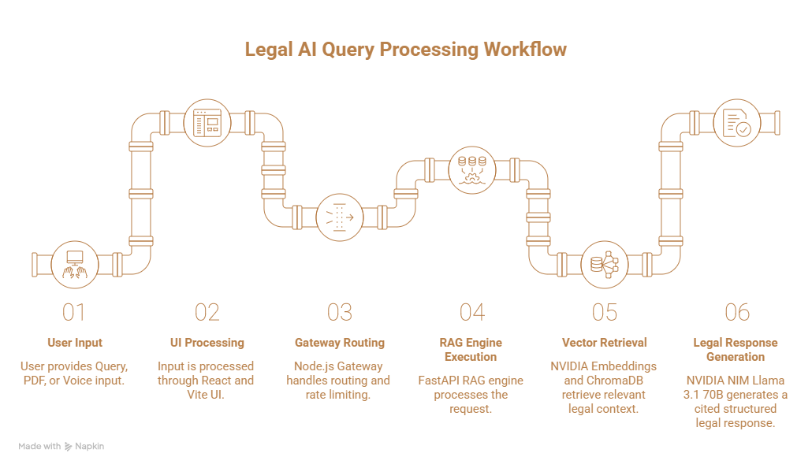

# Tark — AI-Powered Legal Research & Reasoning

Legal AI is a retrieval-augmented legal research platform focused on Indian statutes (IPC and BNS). It combines a retrieval layer, a vector store, and NVIDIA-powered reasoning models to provide concise, citation-backed legal research.

## Overview
- Intelligence: NVIDIA NIM serving Llama 3.1 (70B and 8B) for legal reasoning.
- Retrieval: NVIDIA embeddings and ChromaDB for semantic search.
- Data: IPC and BNS statute corpus, OCR-cleaned and indexed.

## Quick start
1. Clone the repository.
2. Copy .env.example to .env and set credentials.
3. Install dependencies: `npm install` and `pip install -r rag_service/requirements.txt`.
4. Start locally: `npm run dev:all`.

## License
See LICENSE file.

